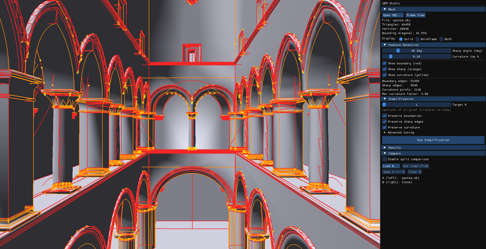
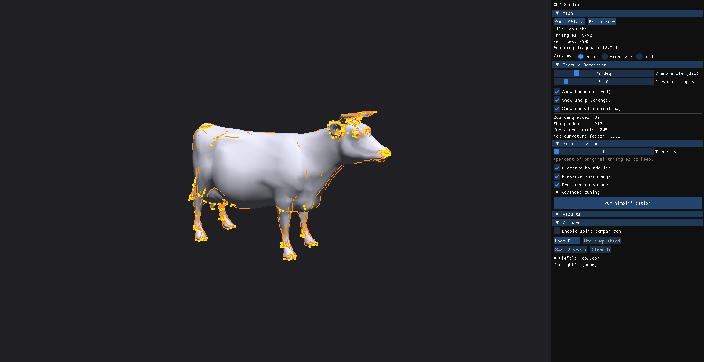
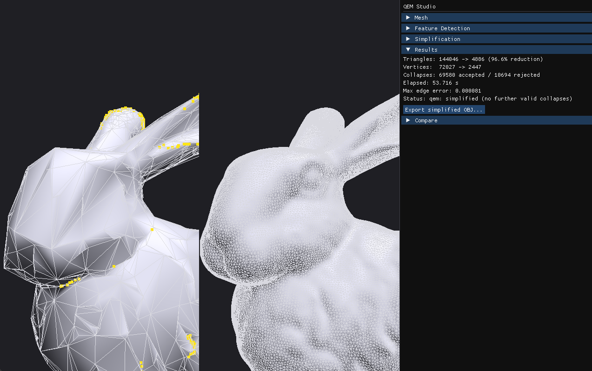

# QEM Studio

A desktop app for **3D mesh simplification** via Quadric Error Metrics, with feature-aware preservation of boundaries, sharp edges, and high-curvature regions. Rendered through [Glint3D](https://github.com/QuinnAho/Glint3D), my custom OpenGL engine.



## What it does

Reduce a high-poly mesh to a target triangle count while keeping the geometry that defines its shape.

- **Feature detection** — boundary loops, crease edges (angle threshold), and curvature hotspots, visualized live in the viewport.
- **Preservation toggles** — independently weight boundaries, sharp edges, and curvature into the QEM cost.
- **Compare view** — split viewport with a shared orbit camera for one-click before/after.
- **Responsive UI** — simplification runs on a background thread; the viewport stays interactive.





## Architecture

The simplifier is decoupled from the renderer. Core algorithms (`src/core`) sit behind a backend interface (`src/backends`); the ImGui front-end (`src/gui`) is a consumer, not a dependency. Swapping renderers or driving the simplifier headless is a matter of writing a new backend.

**Stack:** C++ · CMake · [Glint3D](https://github.com/QuinnAho/Glint3D) · GLFW · Dear ImGui · Eigen · Python

## Quick start

Double-click `build-and-run.bat` (or run it from a terminal):

```bat
build-and-run.bat release run
```

Open an `.obj`, pick a target percent, hit **Run Simplification**. Sample meshes (cow, bunny, Sponza) ship under `resources/models/` if you don't have your own.

## Engineering notes

- **`docs/PERFORMANCE_ANALYSIS.md`** — a profiling-driven optimization (`std::map` → `std::unordered_map`) that benchmarked worse, was reverted, and is documented as a negative result.
- **`docs/PRESERVATION_OBSERVATIONS.md`** — where preservation helps (cow, Sponza) versus where the curvature metric struggles (dense meshes like the Stanford bunny), with proposed fixes.
